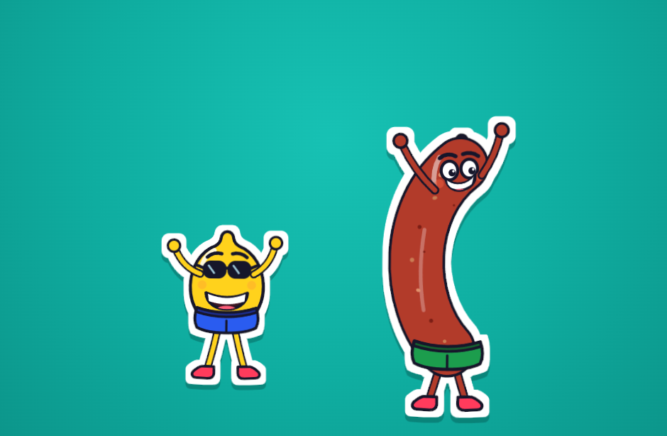

# animated-sticker

Mascotas *sticker* animadas como **Web Components** — sin dependencias, sin build, sin framework.
Funcionan igual en HTML plano, React, Vue, Svelte o WordPress: son elementos HTML nativos.



## Personajes

| Elemento | Personaje |
|----------|-----------|
| `<sticker-limon>`   | 🍋 Limón con gafas de sol, shorts azules y piernas palillo. |
| `<sticker-chorizo>` | 🌭 Chorizo/chistorra, embutido curvo atado con cuerda, shorts verdes. |

Cada uno es SVG vectorial (~6 KB, ~1,5 KB con gzip): escala a cualquier tamaño sin pixelarse
y respeta `prefers-reduced-motion`.

---

## Instalación

No hace falta publicar en npm — se instala directamente desde GitHub:

```bash
npm install agustinamu/animated-sticker#v0.1.0
```

O sin instalar nada, por CDN (jsDelivr sirve desde el repo):

```html
<script type="module"
  src="https://cdn.jsdelivr.net/gh/agustinamu/animated-sticker@v0.1.0/src/index.js"></script>
```

> Fija siempre una versión (`@v0.1.0`) para que el CDN cachee y no te cambie bajo los pies.

---

## Uso

### HTML plano

```html
<script type="module"
  src="https://cdn.jsdelivr.net/gh/agustinamu/animated-sticker@v0.1.0/src/index.js"></script>

<sticker-limon></sticker-limon>
<sticker-chorizo size="180"></sticker-chorizo>
```

### Con bundler (Vite, webpack, etc.)

```js
import 'animated-sticker';   // registra <sticker-limon> y <sticker-chorizo>
```

```html
<sticker-limon size="240" speed="1.5"></sticker-limon>
```

### React

Los Web Components son elementos nativos, así que funcionan directamente en JSX:

```jsx
import 'animated-sticker';

export default function App() {
  return <sticker-limon size="200" feet="off" />;
}
```

### Vue

```vue
<script setup>
import 'animated-sticker';
</script>

<template>
  <sticker-chorizo size="200" />
</template>
```

> En Vue, marca los `sticker-*` como custom elements en la config de compilación
> (`compilerOptions.isCustomElement = tag => tag.startsWith('sticker-')`).

---

## Atributos

| Atributo | Valores | Por defecto | Qué hace |
|----------|---------|-------------|----------|
| `size`   | número (px) o cualquier medida CSS (`"200"`, `"50%"`, `"10rem"`) | `320px` | Alto del sticker (mantiene proporción). |
| `speed`  | número > 0 | `1` | Multiplicador de velocidad (`2` = doble, `0.5` = mitad). |
| `feet`   | `"off"` | *(los pies bailan)* | `feet="off"` deja las **piernas quietas**. |
| `paused` | *(presente)* | — | Congela toda la animación. |

```html
<sticker-limon size="180" speed="1.5"></sticker-limon>
<sticker-limon feet="off"></sticker-limon>   <!-- pies quietos -->
<sticker-limon paused></sticker-limon>        <!-- congelado -->
```

Los atributos son reactivos: cámbialos por JS y se actualiza en vivo.

```js
const limon = document.querySelector('sticker-limon');
limon.setAttribute('feet', 'off');   // detiene solo las piernas
limon.setAttribute('speed', '3');    // acelera el baile
```

Accesibilidad: si el sistema pide reducir el movimiento (`prefers-reduced-motion`),
el sticker se queda quieto automáticamente.

---

## Sin JavaScript: SVG suelto

En `assets/` hay una versión `.svg` autónoma y ya animada, útil para correos,
presentaciones o sitios donde no puedes meter JS:

```html

```

---

## Desarrollo

```bash
git clone https://github.com/agustinamu/animated-sticker.git
cd animated-sticker
npm run demo        # sirve la carpeta; abre http://localhost:8080/demo/
```

Estructura:

- `src/sticker-base.js` — clase base: Shadow DOM, atributos comunes y animación compartida.
- `src/limon.js`, `src/chorizo.js` — cada personaje (solo su dibujo SVG).
- `src/index.js` — registra todos los personajes.
- `assets/` — versiones `.svg` sueltas.
- `demo/` — página de demostración.
- `design/` — exploraciones de estilo (no se publican en el paquete npm).

### Añadir un personaje nuevo

Todos comparten los mismos **puntos de anclaje** de la animación (hombros en
`96,152` y `204,152`, caderas en `135,252` y `165,252`, centro de balanceo en
`150,300`). Un personaje nuevo es solo dibujar su SVG con las clases
`sway` / `arm-l` / `arm-r` / `leg-l` / `leg-r` y extender `StickerBase`:

```js
import { StickerBase } from './sticker-base.js';

export class StickerNuevo extends StickerBase {
  get svg() { return `<svg viewBox="0 0 300 430">…</svg>`; }
}
customElements.define('sticker-nuevo', StickerNuevo);
```

---

## Licencia

[MIT](./LICENSE) © agustinamu — úsalo, cópialo y modifícalo libremente.
